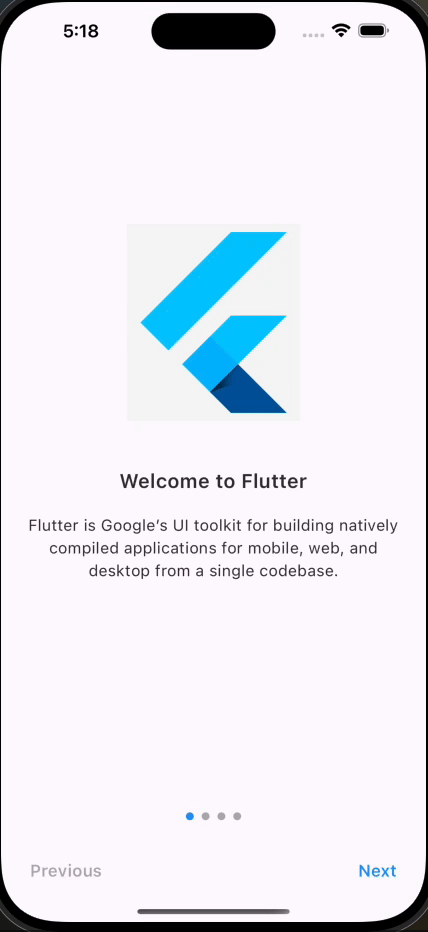

# custom_carousel_app_journey

A versatile Flutter package designed to create engaging and visually appealing carousel-based onboarding screens or to
showcase your app's journey in a smooth, user-friendly manner. This package offers an easy way to introduce your app to
new users or to highlight the key features of your application through a series of customizable slides.

## Features

- **Onboarding Screens**: Effortlessly create onboarding screens to guide your users through the app’s features or to
  introduce your app to new users.
- **App Journey Showcase**: Highlight the journey of your app or the steps users should follow to achieve certain tasks
  within your app, enhancing user experience and app usability.
- **Highly Customizable**: Customize the look and feel of your carousels to match your app’s design. Adjust colors,
  fonts, slide transitions, and more.
- **Easy to Implement**: With minimal setup, you can integrate the carousel into your app, thanks to our
  straightforward package and comprehensive documentation.
- **Responsive Design**: Looks great on both iOS and Android devices, providing a seamless experience across all
  platforms.
- **Interactive Elements**: Incorporate buttons, links, or any call-to-action elements within your slides to make the
  carousel interactive and actionable.

## Screens

Basic Carousel app journey demo with the text button type:



Basic Carousel app journey demo with the icon button type:


## Getting started

This package is designed to be easy to use and integrate into your app. To get started, follow the installation
instructions below and then refer to the usage section for a quick guide on how to use the package.

### Installation

In the `dependencies:` section of your `pubspec.yaml`, add the following line:

```yaml
dependencies:
  custom_carousel_app_journey: <latest_version>
```

## Usage

To use this package, you need to import it into your Dart code and then use the `CustomCarouselAppJourney` widget to
create your carousel. Below is a simple example of how to use the package to create a basic carousel app journey.

```dart
import 'package:custom_carousel_app_journey/custom_carousel_app_journey.dart';
```

```dart
CustomCarouselAppJourney(
  slides: const [
    AppJourney(
      title: 'Welcome to Flutter',
      image: 'assets/ic_flutter_logo.png',
      description:
      'Flutter is Google’s UI toolkit for building natively compiled applications for mobile, web, and desktop from a single codebase.',
    ),
    AppJourney(
      title: 'Welcome to Dart',
      image: 'assets/ic_flutter_logo.png',
      description:
      'Dart is a client-optimized language for fast apps on any platform.',
    ),
    AppJourney(
      title: 'Welcome to Dart',
      image: 'assets/ic_flutter_logo.png',
      description:
      'Dart is a client-optimized language for fast apps on any platform.',
    ),
    AppJourney(
      title: 'Welcome to Material',
      image: 'assets/ic_flutter_logo.png',
      description:
      'Material is a design system created by Google to help teams build high-quality digital experiences for Android, iOS, Flutter, and the web.',
    ),
  ],
)
```

you can use the CarouselOptions to customize the carousel as per your requirement. Below is an example of how to use the
CarouselOptions to customize the carousel. You can 'Text' or 'Icon' for the buttonType. the icons will display based on
platform. For example, on Android, it will display 'arrow_back' and 'arrow_forward' icons and on iOS, it will display '
arrow_back_ios' and 'arrow_forward_ios' icons.

## Carousel Options

```dart
CarouselOptions(
  imageHeight: 200.0,
  titleFontSize: 20.0,
  subTitleFontSize: 18.0,
  buttonFontSize: 28.0,
  buttonType: CarouselButtonTypes.text,
  // or CarouselButtonTypes.icon
  onDoneButtonPressed: () {
    // The callback when the done button is pressed to perform an action
    print('Done button pressed');
  },
)
```

## Additional information

Custom Carousel App Journey is a versatile package that can be used in a variety of ways to enhance your app’s user,
experience. Whether you want to introduce new users to your app or highlight the key features of your application, this
package provides a simple and effective way to do so. For more information on how to use the package, refer to the
[online documentation](https://pub.dev/packages/custom_carousel_app_journey). If you have any questions, suggestions, or
feedback, feel free to reach out to the package authors or file an issue [issue_tracker](https://github.com/noorj-in/custom_carousel_app_journey/issues) on the package’s GitHub repository.


